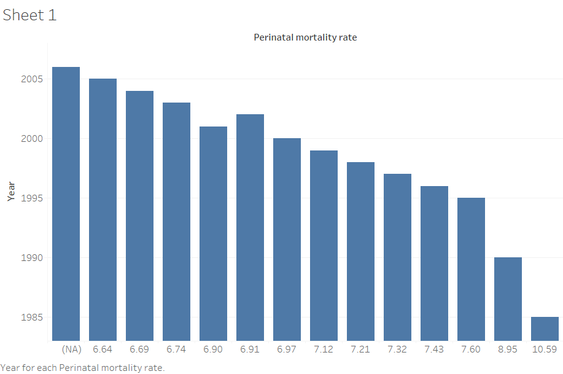
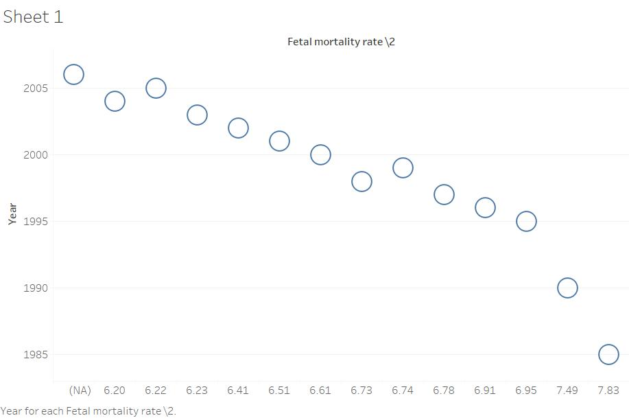
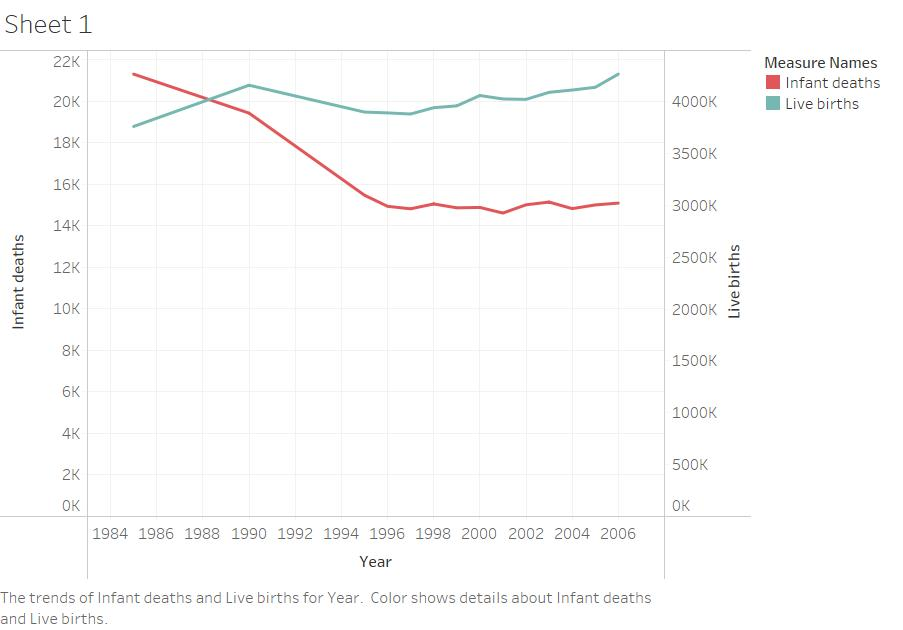
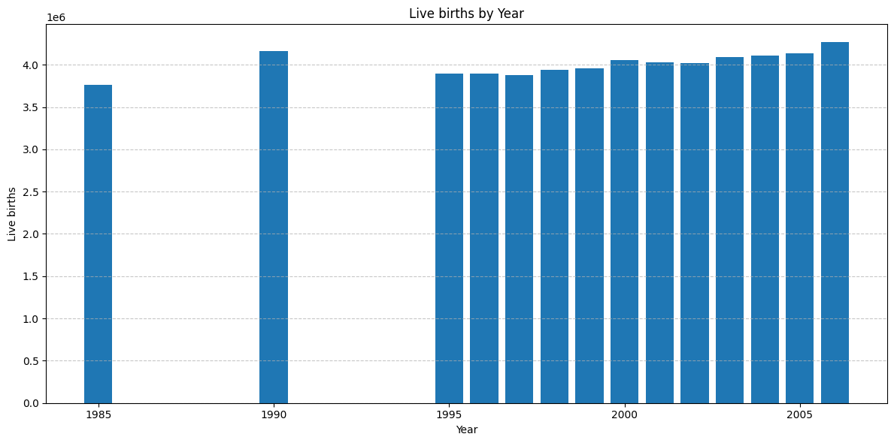

CS 625-HW3
================
10/06/2023

# Data : 

As per the data I downloaded it from the 2012 Statistical
Abstract of the United States. I downloaded the 114 - Fetal and Infant
Deaths \[\<1.0 MB\] data from the mentioned website. 
Data Source:
<https://www.census.gov/library/publications/2011/compendia/statab/131ed/births-deaths-marriages-divorces.html>

It contains Year, Fetal Death, Infant Death, Live Births, Fetal
moratality rate and Perinatal mortality rate.

# Data Manipulation: 

I used Openrefine to clean the dataset. The dataset
contains some matter I deleted that and also some blank values.

# Visualization Idioms:

I created the *Bar chart *Scatterplot \*Multiple
Lines

I believe the charts I used in this HW3 is appropritate because barchart
is used for comparison and scatterplot for any outliers and multiple
lines for comparing two column at a time. These all are done in this
Homework.

# BarChart

Idom: barchart mark: Bar Data field: year & Encoding: Year (Horizontal
Position)

Idiom: Bar Chart / Mark: Line
| Data: Attribute | Data: Attribute Type  | Encode: Channel | 
| --- |---| --- |
| year | key, categorical | vertical spatial region (y-axis) |
| perinatal mortality rate | value, quantitative | horizontal position on a common scale (x-axis) |

#Scatter plot

Idom: scatter plot Mark: point Data field: year & Encoding:
Year

Idiom: Bar Chart / Mark: Line
| Data: Attribute | Data: Attribute Type  | Encode: Channel | 
| --- |---| --- |
| year | key, categorical | vertical spatial region (y-axis) |
| perinatal mortality rate | value, quantitative | horizontal position on a common(x-axis) |

# Multiple lines

Idom: Multiple Lines mark: Line Data field: year & Encoding: year

Idiom: Bar Chart / Mark: Line
| Data: Attribute | Data: Attribute Type  | Encode: Channel | 
| --- |---| --- |
| year | key, categorical | vertical spatial region (y-axis) |
| Infant death | value, quantitative | horizontal position on a common  (x-axis) |

#Reflection 

I created a barchart using Google Colab. But I found
Tableau is good to create charts in colab I got some different charts in

colab. So, I feel tableau is good to create charts for visualization.
Colab:<https://colab.research.google.com/drive/1BneiAO85gsVJb1R1zWYjzKtPhUXNnTpv?usp=sharing>

# References:

<https://www.census.gov/library/publications/2011/compendia/statab/131ed/births-deaths-marriages-divorces.html>
Colab:<https://colab.research.google.com/drive/1BneiAO85gsVJb1R1zWYjzKtPhUXNnTpv?usp=sharing>
